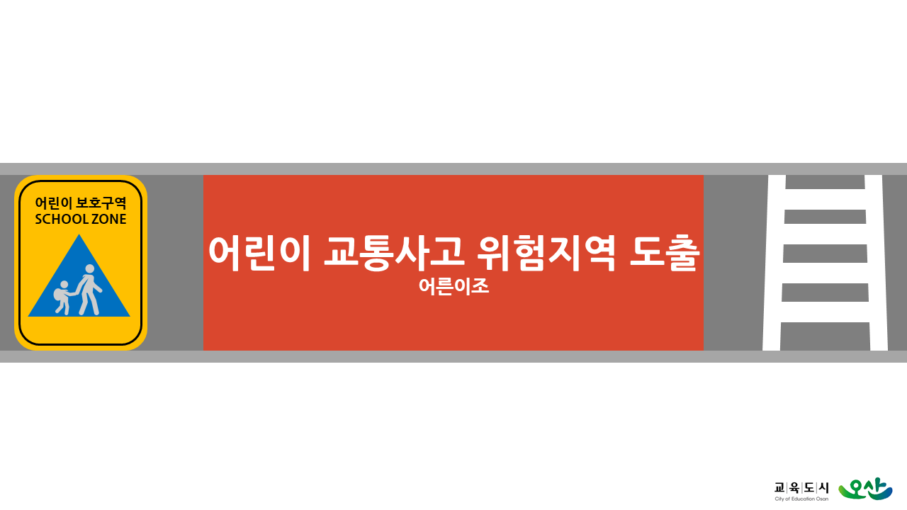
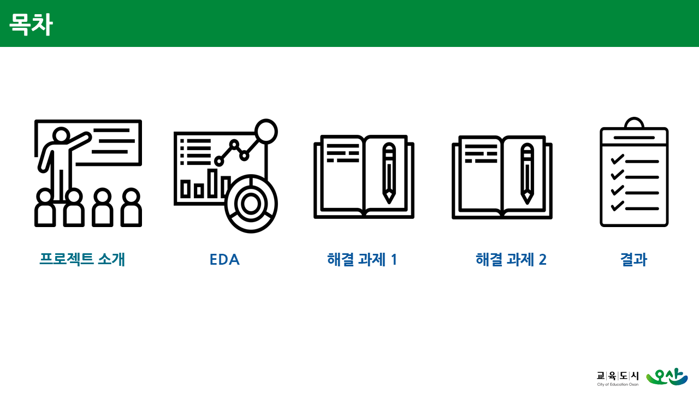
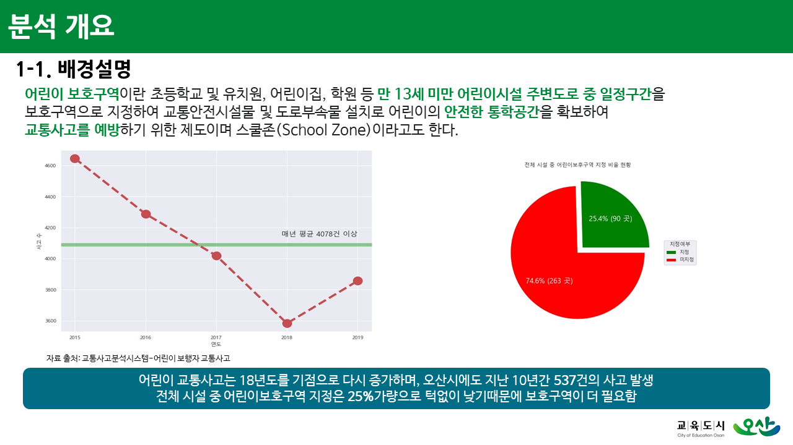
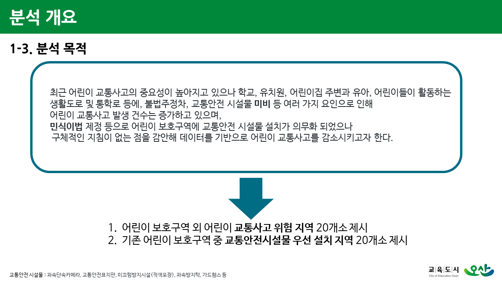
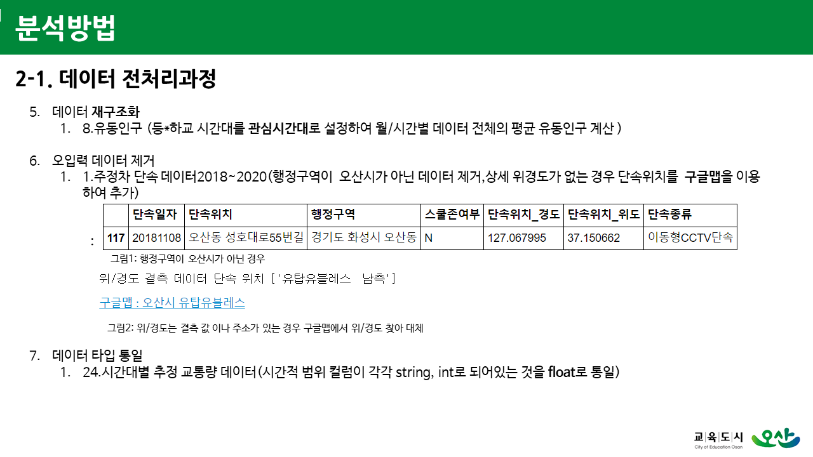
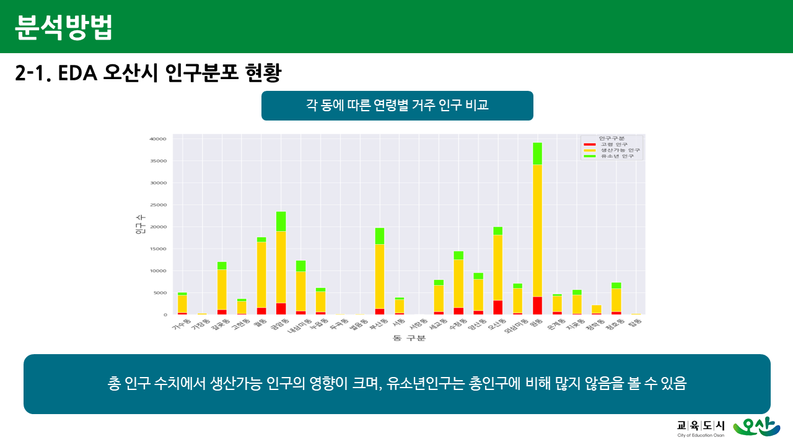
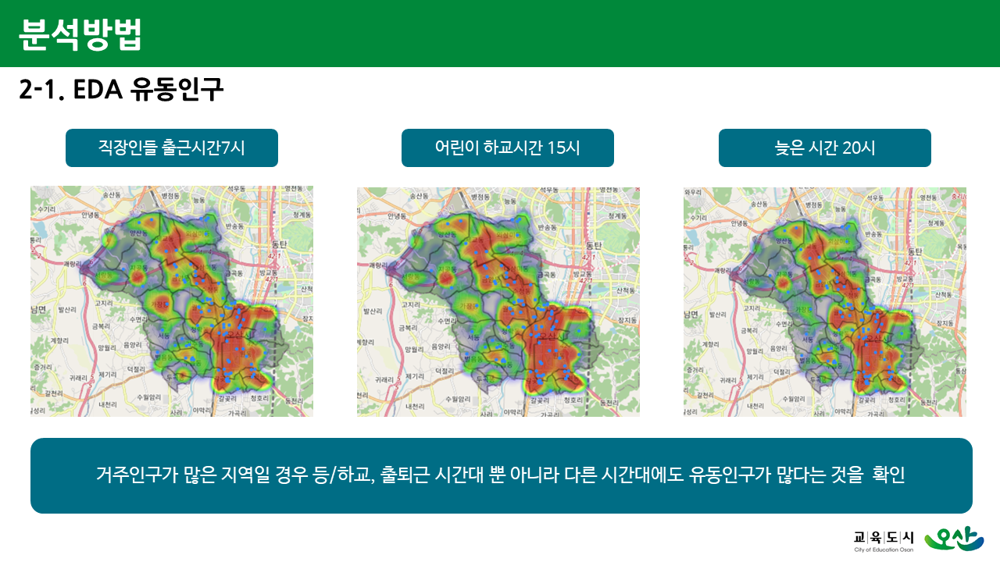
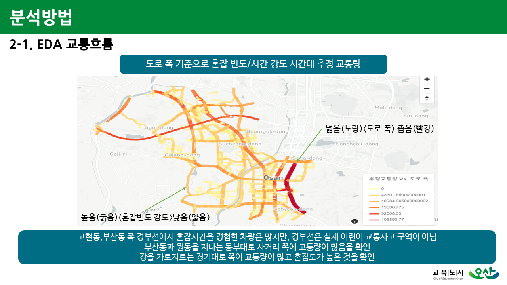
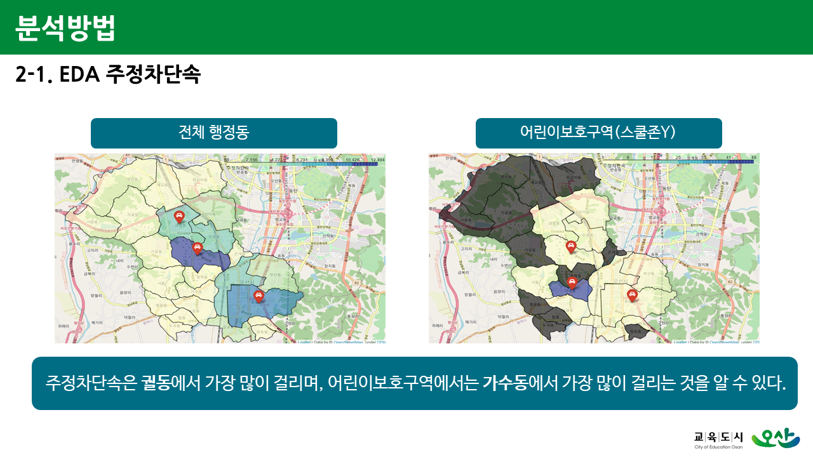

## <오산시 어린이 교통사고 위험구역 도출> 데이터 분석 및 시각화
- __주관__ : LH COMPAS [Link](https://compas.lh.or.kr/subj/past/info?subjNo=SBJ_2012_001) 
- __기간__ : 2020.12.10 ~ 2021.1.28
- __참여__ : [**ineed-coffee**](https://github.com/ineed-coffee) , [**ikeven94**](https://github.com/ikeven94) , [**cjlee0217**](https://github.com/cjlee0217) , [**heewonp**](https://github.com/heewonp) 
- __실행 소스코드 및 결과보고서__ : [【Submit】](/[Submit]) 폴더

 

 

## 분석 개요 (일부 슬라이드 예시)  

 
  

## EDA (일부 슬라이드 예시)  

### `데이터 전처리`  
  
### `오산시 전반적 EDA`  
 
 
 
 